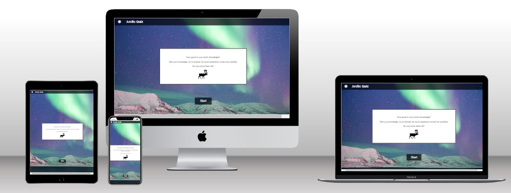

# Arctic Quiz 

With the current climate change the face of the artic is changing rapidly. This has a major impact on the flora and fauna. Small children don't know a lot about the artic. The Artic quiz was developed for children to improve their knowledge about the artic and stimulate their curiosity in a fun and interactive way. In this way we hope to contribute to the overall conscience of the people. 

##  Table of content
- [User Experience (UX)](#user-experience--ux-)
- [Technologies used](#technologies-used)
- [Features](#features)
- [Testing](#testing)
- [Deployment](#deployment)
- [Credits](#credits)

## User Experience (UX)
### User stories
#### Visitor Goals
- The main goal is to provide the users more information about the arctic
- The user should have good insight in the content when viewing the startpage
- The user should have an intutive and easy accesible buttons to start the quiz
- The user should receive direct feedback on the answer
- The user should have the possiblity to restart the quiz and try to improve

### Design 

For the design the choice is made for a 

1. Images

background image 

quiz image 

2. Colour Scheme

black and white to provide optimal accesibilty 

3. Typography

## Technologies used 
### languages
- CSS
- HTML
- Javascript

### Frameworks, Libraries & Programs Used
- [font awesome](https://fontawesome.com/): all the icons on this webpage are from Font awesome
- Git: Git was use commit and push to github 
- [GitPod](https://gitpod.io/): Gitpod was used as development environment 
- [GitHub](https://github.com/): Github was used to deploy the site and store it  

## Features
### Instructions
The website is a single page website. 

### Questions
The Hero image tries to create a mystical and creative mood. We want to show the image of how books spark our imagination. 

On the hero image you also find "kids book swap club Stockholm" so you know what we do and we are located in Stockholm. 
Under this you also get the text "find books in your mother tongue" so you know it is meant for a expat public. 

### Questions with direct feedback 
In this section of our webpage we shortly describe why we think reading is important and how we want to support this. We also provide the basic information about our events. 

The text is supported by a picture of a child reading to support the image off reading as a fun and constructive activity.  

### Feedback en score
In this section we show the upcoming events with the group, place, date and time. 

## Testing 
## testing of the user story
### User stories

|Goal| execution|
|--------------------------------------------------------------------------------------|-------------------------------------------------------|
|The users should learn more about the arctic| |
|The user should have good insight in the content when viewing the startpage| |
|The user should have an intutive and easy accesible buttons to start the quiz| |
|The user should receive direct feedback on the answer| |
|The user should have the possiblity to restart the quiz and try to improve| |
 
## manual code testing
### responsiveness
The website is adapted to be seen on different screen sizes. 
The responsiveness of the website was first tested by chrome developer tools. 
Different breakpoints where used to view the website. 
Next to this the website was viewed on different devices: laptop, tablet and smartphones. 

### Browser compatibility 
The website was tested in different browsers. 

|Browser| compatibility|
|------------------------------------|-------------|
|Mozilla Firefox versie 102.0|no problems|
|Microsoft Edge Versie 103.0.1264.44|no problems|
|Google Chrome Versie 103.0.5060.114 | no problems|

### Validator Testing 
1. HTML

No errors where found by the official W3C validator

2. CSS
No errors where found by the official Jigsaw validator

### Fixed bugs 
- Website had a gap on the right which was visible with a smaller screen size. This was fixed by removing padding from a section. 
- Changes in font and font-sizes where fixed by target the text specifically in CSS. 

### Unfixed bugs
The navigation bar seems to be affected by the animation. The cause of this isn't found yet. 

## Deployment 
This site was deployed by GitHub pages. 

To deploy a page you first go to the GitHub repository, then you go to setting. 
Afterwards you go to the subsection pages. 
Next go to the source section and select Branch:main. 
Press save and then you receive a link.  

The link can be found here: https://vanhouttestien.github.io/book_swap/

## Credits

### Images
-  	Image used for heroimage [Image](https://pixabay.com/illustrations/book-dog-fairy-tales-child-kid-794978/) by 0fjd125gk87 from Pixabay 
-	Image used in the 'what we do' section [Image](https://pixabay.com/photos/baby-read-play-reading-playing-5953965/)  by Катерина Кучеренко from Pixabay 
-   Image adapted and used as a background in the 'upcoming events section' [Image](https://pixabay.com/photos/art-watercolors-arts-and-crafts-1851483/by)  Pexels from Pixabay 

### code 
- On the website of the  [w3schools](https://www.w3schools.com/) I found a lot of information and codes for a variety of problems encountered
- Varies parts of the website were inspired by the love math website from Code institute 

polar bear: Image by 358611 from Pixabay  https://pixabay.com/photos/polar-bear-bear-sea-bear-white-404314/
artic fox Image by dclobes from Pixabay  https://pixabay.com/photos/artic-fox-mammal-wildlife-2641974/
pinguin: Image by Siggy Nowak from Pixabay  https://pixabay.com/photos/penguins-emperor-penguins-baby-429134/
reindeer: Image by Decokon from Pixabay https://pixabay.com/photos/svalbard-reindeer-reindeer-svalbard-2144689/
aurora borealis: Image by Noel Bauza from Pixabay https://pixabay.com/photos/adventure-aurora-northern-lights-1573331/
arctic icemontain: Image by 358611 from Pixabay https://pixabay.com/photos/iceberg-antarctica-polar-ice-sea-404966/
pinguin2: Image by Edgar Winkler from Pixabay https://pixabay.com/photos/penguin-animal-bird-wildlife-zoo-2555024/
polarbear and baby: Image by Ria Sopala from Pixabay  https://pixabay.com/photos/polar-bear-infant-child-girl-teddy-6819212/ 
Houses in snow  Image by JaymzArt from Pixabay https://pixabay.com/illustrations/christmas-tree-gifts-snowman-4703449/
Reindeer silhouette: Image by Clker-Free-Vector-Images from Pixabay  https://pixabay.com/vectors/reindeer-animal-pole-north-48519/

questions
https://wmo.asu.edu/content/world-lowest-temperature

mock-up 
https://techsini.com/multi-mockup/